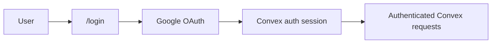
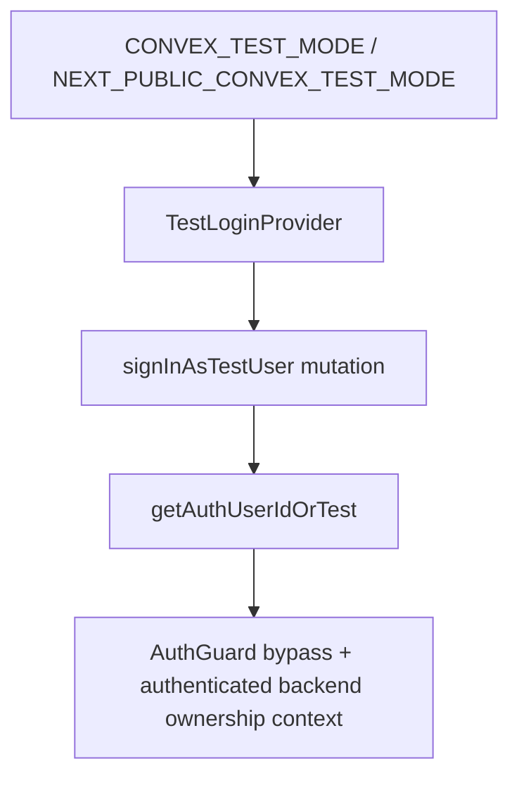
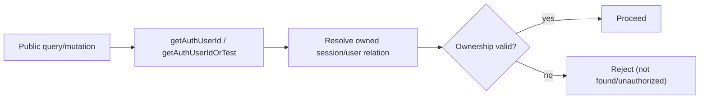

# Auth and Ownership Plan

## Scope

- Production auth is handled by `@convex-dev/auth` with Google OAuth.
- Frontend session state is managed by `ConvexAuthNextjsProvider`.
- Test/E2E mode uses `makeTestAuth` + deterministic test user bootstrap.
- `oh-my-openagent` is CLI-based and does not provide a reusable web-auth baseline, so web auth is first-class in this app.

References:

- `@convex-dev/auth` docs: https://labs.convex.dev/auth

## Production Auth Model

- Backend auth module defines `convexAuth({ providers: [Google] })` and exports `auth`, `signIn`, `signOut`, `isAuthenticated`, `store`.
- Frontend uses `ConvexAuthNextjsProvider` to maintain auth session and attach credentials to Convex requests.
- Login route starts Google OAuth; after success, user returns to authenticated app routes.

## Runtime Auth Flow

1. User reaches `/login`.
2. User clicks Google sign-in.
3. OAuth callback finalizes session via `@convex-dev/auth` backend routes.
4. `ConvexAuthNextjsProvider` exposes authenticated state to client via `useConvexAuth`.
5. Protected routes render only when authenticated.

## AuthGuard and Protected Routes

- `AuthGuard` wraps protected routes (`/`, `/chat/[id]`, `/settings`).
- It reads `useConvexAuth()` and enforces redirect to `/login` when unauthenticated.
- In test mode, it bypasses auth checks.

### Required Guard Logic

- If `NEXT_PUBLIC_CONVEX_TEST_MODE === 'true'`, render children directly.
- Else if `isLoading`, render loading/null placeholder.
- Else if `!isAuthenticated`, `router.replace('/login')`.
- Else render children.

## Test Auth Model

- Backend test identity helpers are built with `makeTestAuth`.
- Public mutation `signInAsTestUser` ensures deterministic test user exists.
- All public backend handlers use `getAuthUserIdOrTest`, not raw `getAuthUserId`.
- Frontend `TestLoginProvider` calls `signInAsTestUser` on mount in test mode before rendering children.

## Ownership Boundary Rule

- Every public endpoint derives `userId` from auth (`getAuthUserIdOrTest`) inside the handler.
- Client-provided `userId` is never accepted for ownership decisions.
- Any `sessionId`, `threadId`, `taskId`, or `mcpServer` access is resolved through an owned record chain.

### Enforcement Chain

## Full Ownership Audit (Public Endpoints)

### Sessions

- `sessions.list`: filters by authenticated `userId` via `by_user_status`.
- `sessions.createSession`: session row written with authenticated `userId`.
- `sessions.getSession`: verifies `session.userId === authUserId`.
- `sessions.submitMessage`: loads `sessionId`, verifies ownership, then writes message/enqueue.
- `sessions.archiveSession`: verifies session ownership before archive mutation.
- `sessions.getRunState`: resolves owned session by `threadId` before returning run state.

### Messages

- `messages.list` (or equivalent public message list):
  - resolves authenticated user,
  - validates thread ownership through `session.by_user_threadId`,
  - for worker threads, resolves `task -> session -> user` chain before return.

### Tasks

- `tasks.listTasks`: verifies `sessionId` ownership before listing tasks.
- `tasks.getOwnedTaskStatus`: resolves requester owned session by `threadId`, then checks `task.sessionId` matches.

### Todos

- `todos.listTodos`: verifies session ownership before listing todos.

### Token Usage

- `tokenUsage.getTokenUsage`: verifies session ownership before aggregation; returns zeroed payload for unauthorized access.

### MCP Servers

- `mcp.listMcpServers`, `mcp.addMcpServer`, `mcp.updateMcpServer`, `mcp.deleteMcpServer`:
  - ownership enforced by CRUD layer (`userId`-scoped rows),
  - uniqueness and URL safety enforced in hooks,
  - secrets redacted on read.

### Test Auth Endpoint

- `testauth.signInAsTestUser`:
  - callable only when test mode is enabled,
  - creates/returns deterministic test user,
  - never enabled in production mode.

## Production Safety Requirements

- `CONVEX_TEST_MODE` must never be set in production deployments.
- CI/CD should enforce explicit guardrails:
  - fail deploy if `CONVEX_TEST_MODE=true` in production env set,
  - verify Google OAuth secrets are present for production,
  - verify test-only frontend env (`NEXT_PUBLIC_CONVEX_TEST_MODE`) is absent in production build.
- `env.ts` validates production auth variables (`AUTH_SECRET`, OAuth credentials) so missing secrets fail early.
