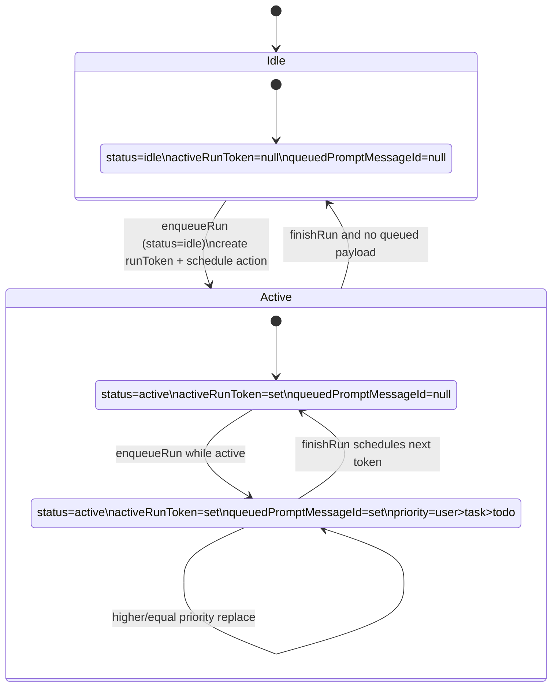
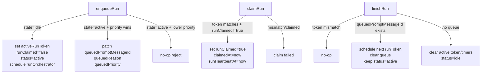
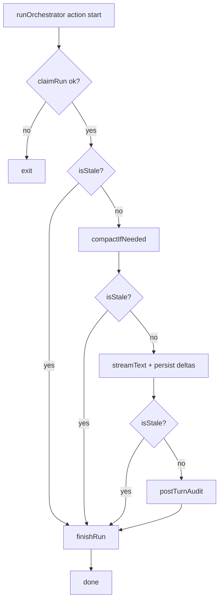
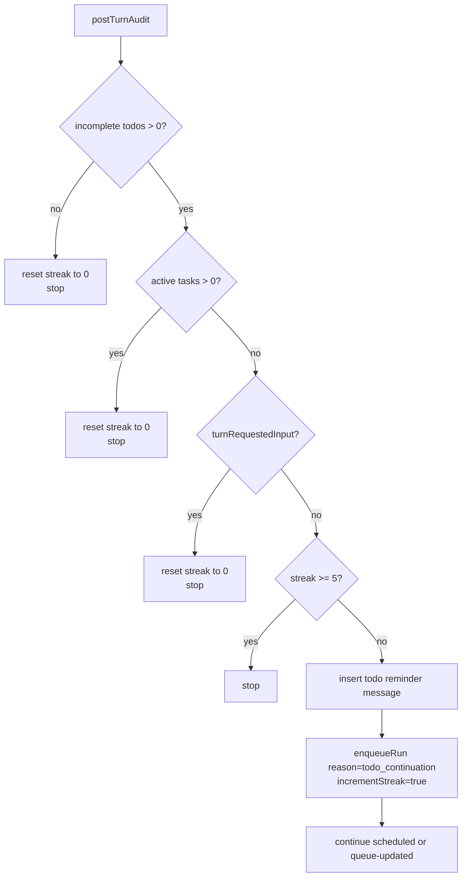
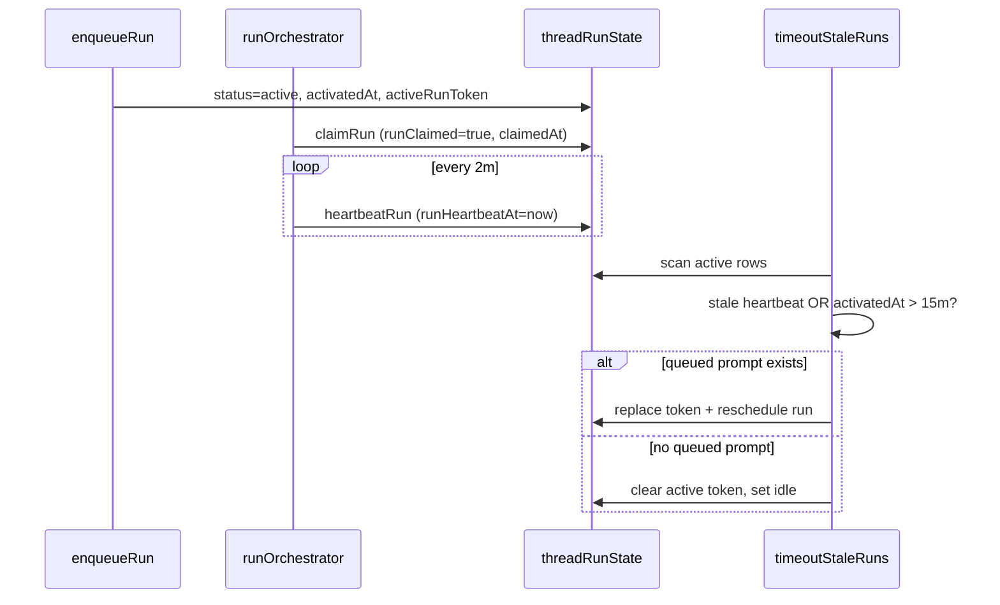

# Orchestrator Runtime (DIY AI SDK v6)

This document extracts and rewrites the runtime plan from `PLAN.md` for a **DIY orchestrator**: no agent component, no framework-managed message store. We run AI SDK v6 `streamText()` directly inside Convex actions and persist all message state in our own Convex `messages` table.

## Scope and References

- PLAN sections: Agent Runtime Flow, Concurrency Policy, Streaming Architecture, Auto-Continue Streak Rules
- AI SDK `streamText`: <https://ai-sdk.vercel.ai/docs/reference/ai-sdk-core/stream-text>
- Convex actions: <https://docs.convex.dev/functions/actions>
- OpenAgent loop reference: `oh-my-openagent/src/index.ts`

## Queue-Per-Thread Concurrency Model

### Core table: `threadRunState`

One row per `threadId`, created lazily by `ensureRunState`. v1 enforces singleton behavior (`by_threadId` unique invariant).

Key fields:

- `status`: `idle | active`
- `activeRunToken`: currently active run token
- `runClaimed`: consuming claim bit for scheduled action delivery dedupe
- `queuedPromptMessageId`: optional single queued payload while active
- `queuedReason`: `user_message | task_completion | todo_continuation`
- `queuedPriority`: explicit persisted priority marker
- `autoContinueStreak`: continuation safety counter (cap `5`)
- `activatedAt`, `claimedAt`, `runHeartbeatAt`: timing and stale-run recovery
- `lastError`: last orchestrator error

### Priority queue policy (single queued slot)

- One active run per thread, plus at most one queued prompt slot.
- Priority order: `user_message (2) > task_completion (1) > todo_continuation (0)`.
- Lower-priority enqueue cannot replace higher queued payload.
- Equal priority replaces older queued payload (newer event wins).
- `user_message` reset behavior: streak resets to `0` when enqueued.

## CAS Transition Contracts

`enqueueRun`, `claimRun`, and `finishRun` are compare-and-set lifecycle mutations.

## `runOrchestrator` Action Flow

v1 action pattern:

1. `claimRun(threadId, runToken)` consuming CAS claim.
2. Build stale guard `isStale()` (token mismatch check).
3. Start heartbeat interval (`heartbeatRun`) while action is alive.
4. Pre-generation compaction for closed prefix.
5. Stream model turn with AI SDK `streamText()` (DIY integration).
6. Run `postTurnAudit` (todo/task/streak continuation logic).
7. Always `finishRun` in `finally`.

## DIY Streaming Architecture (`streamText` + `messages` table)

We do not rely on component message storage. The action writes directly to app tables.

### Write model

- Before stream: insert assistant message row with
  - `isComplete: false`
  - `content: ''`
  - `streamingContent: ''`
  - `role: 'assistant'`
  - `threadId`, `sessionId`
- During stream: append text deltas to in-memory buffer and patch
  - `messages.streamingContent = <latest partial text>`
  - optional throttle (for write pressure)
- On stream completion:
  - `messages.content = finalText`
  - `messages.isComplete = true`
  - `messages.streamingContent = undefined` (or empty string)
- On stream error:
  - keep partial text if needed
  - set `isComplete: true` + error metadata, or leave incomplete for timeout janitor (team choice)

This provides reactive frontend streaming via normal Convex queries on `messages`.

## Post-Turn Auto-Continue Audit

`postTurnAudit` runs after successful turn streaming and evaluates:

- incomplete todos (`pending` or `in_progress`)
- active background work (`tasks` in `pending` or `running`)
- `turnRequestedInput` (v1 always `false`, documented limitation)
- `autoContinueStreak < 5`

If continue is allowed:

1. Save system reminder message in `messages` table.
2. Call `enqueueRun({ reason: 'todo_continuation', incrementStreak: true, promptMessageId: reminderMessageId })`.

## Heartbeat and Wall-Clock Timeout

### Runtime heartbeat

- `runOrchestrator` sends `heartbeatRun` every ~2 minutes while alive.
- `claimRun` initializes `runHeartbeatAt`.

### Recovery cron (`timeoutStaleRuns`)

- Claimed run stale threshold: 15 minutes from latest `runHeartbeatAt` (fallback `claimedAt`).
- Unclaimed scheduled run stale threshold: 5 minutes from `activatedAt`.
- Hard wall-clock cap: 15 minutes from `activatedAt` even if heartbeat continues.
- Recovery behavior:
  - if queued payload exists: mint new run token, schedule next action, clear queue fields
  - if no queued payload: reset to `idle`

## Lifecycle Summary

### `enqueueRun`

- Entry point for user turns and internal continuations.
- Creates active run when idle; otherwise mutates single queued slot with priority rules.
- Owns atomic streak updates (`incrementStreak`).

### `claimRun`

- Consuming claim CAS to absorb duplicate scheduler deliveries.
- Only action instance with matching token and unclaimed slot can proceed.

### `finishRun`

- Finalizes active token.
- Drains queued payload into next scheduled token when present.
- Returns thread to idle when queue is empty.

## Documented v1 Limitations

- Crash gap: if action crashes after reminder write but before continuation enqueue, thread may remain idle until next user input.
- Lost-turn case: if active run dies before answer and no queued payload exists, stale cleanup resets idle without replaying original prompt.
- `turnRequestedInput` is always `false` in v1; input-request detection is deferred.
- Mid-stream stale overlap can still persist partial writes/tool side effects before stale check after `consumeStream()`.
