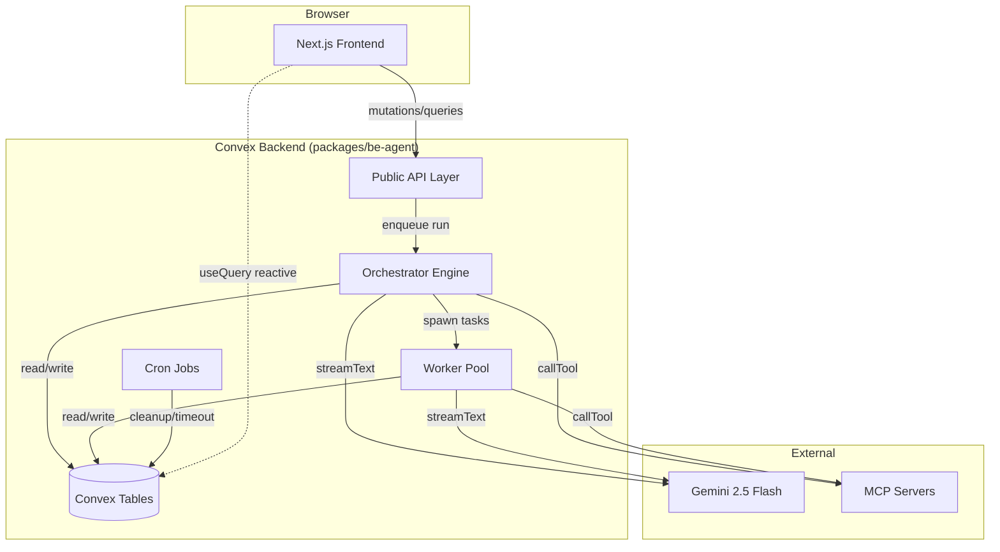
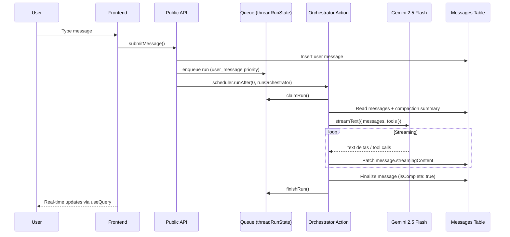

# Agent Harness — Implementation Plan

A web-based AI agent harness inspired by [oh-my-openagent](https://github.com/code-yeongyu/oh-my-openagent) (commit `6625670`), built on the noboil monorepo with Convex + AI SDK v6 + Gemini 2.5 Flash. No vendor lock-in — uses AI SDK directly with our own Convex tables instead of third-party agent components.

After the app works, generic building blocks will be extracted into `@noboil/agent` as a publishable library.

## Motivation

oh-my-openagent is a powerful CLI-based agent harness. We want the same capabilities — parallel tasks, delegation, MCP, streaming, compaction — but for the web, built on our own infrastructure with full control over data and no dependency coupling.

## Table of Contents

| #   | Document                          | Description                                                               |
| --- | --------------------------------- | ------------------------------------------------------------------------- |
| 1   | [Architecture](./architecture.md) | System topology, data flows, streaming design, DIY vs component rationale |
| 2   | [Schema](./schema.md)             | Data model, ER diagram, indexes, ownership chain                          |
| 3   | [Orchestrator](./orchestrator.md) | Queue system, run lifecycle, streaming, auto-continue                     |
| 4   | [Workers](./workers.md)           | Task delegation, worker lifecycle, retry, completion chain                |
| 5   | [Tools](./tools.md)               | Tool definitions — delegate, search, todos, task status                   |
| 6   | [MCP](./mcp.md)                   | MCP integration, discovery, caching, SSRF protection                      |
| 7   | [Compaction](./compaction.md)     | Message compaction, closed-prefix grouping, lock mechanism                |
| 8   | [Frontend](./frontend.md)         | Pages, components, streaming UI, accessibility                            |
| 9   | [Auth](./auth.md)                 | Auth flow, test auth bypass, ownership enforcement                        |
| 10  | [Ops](./ops.md)                   | Crons, session retention, cleanup, monitoring                             |
| 11  | [Testing](./testing.md)           | E2E strategy, mock model, test auth                                       |
| 12  | [Phases](./phases.md)             | Implementation phases with dependencies and success criteria              |
| 13  | [References](./references.md)     | Official doc URLs, oh-my-openagent source paths, SOURCES.md               |

## High-Level Architecture

## Message Flow

## Capabilities

- Parallel sync/async/background tasks with system reminder injection
- Search via Gemini grounding search (isolated action, no tool mixing)
- MCP server management (user-owned, SSRF-protected, per-call timeouts)
- Multi-agent delegation (orchestrator → workers with separate threads)
- Todo list with auto-continuation
- Token usage tracking per session/agent
- Message compaction (closed-prefix summarization)
- Real-time streaming to frontend via Convex reactive queries

## Explicitly Excluded

Undo messages, fork conversation, switch models/orchestrator, plan mode, slash commands, file editing, code execution, CLI tools.

## Key Decisions

| Decision        | Choice                                              | Rationale                                                               |
| --------------- | --------------------------------------------------- | ----------------------------------------------------------------------- |
| Agent framework | DIY (AI SDK + own tables)                           | No vendor lock-in, full data control, publishable as `@noboil/agent`    |
| LLM             | Gemini 2.5 Flash                                    | Cost-effective, supports grounding search                               |
| Streaming       | Own messages table + `streamingContent` field       | Reactive `useQuery` gives real-time updates, no opaque component tables |
| Schema          | Zod via `@noboil/convex` (`ownedTable`, `makeBase`) | Matches monorepo conventions                                            |
| CRUD            | noboil `crud()` with hooks where applicable         | Eliminates boilerplate, enforces ownership                              |
| Auth            | `@convex-dev/auth` + Google OAuth                   | Standard Convex auth, test mode bypass for E2E                          |
| MCP transport   | HTTP only (StreamableHTTPClientTransport)           | Convex serverless has no stdio                                          |
