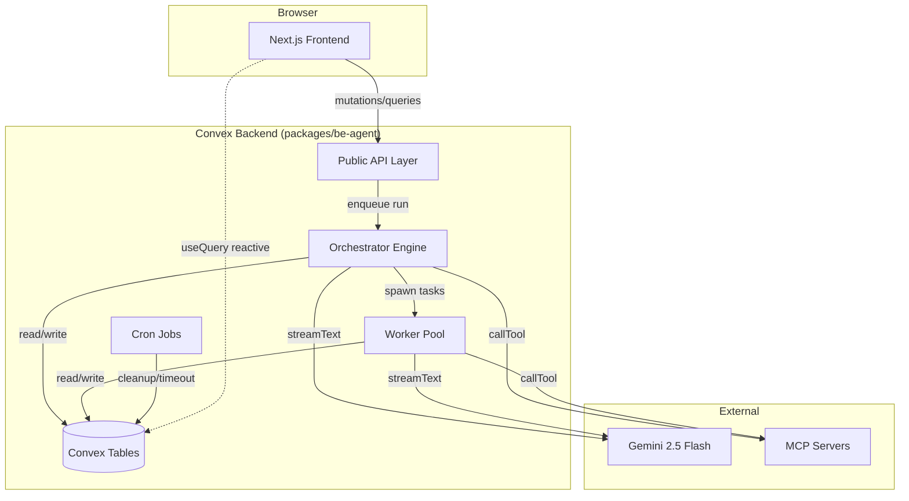
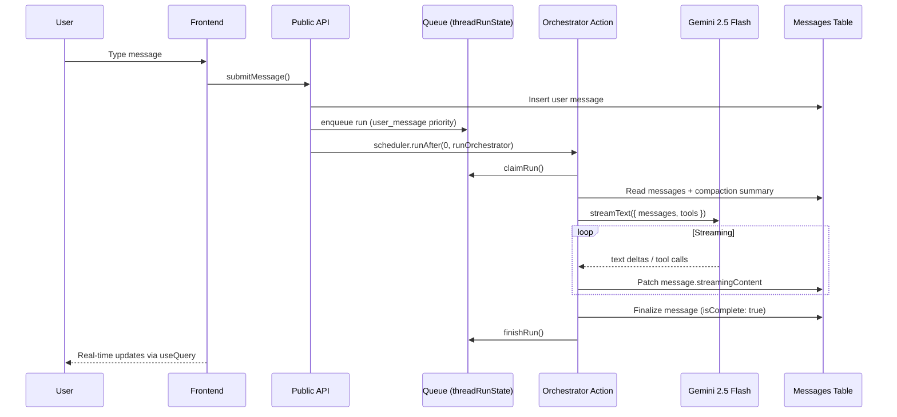

# Agent Harness — Implementation Plan

A simplified web version of oh-my-openagent ([commit `5073efe`](https://github.com/code-yeongyu/oh-my-openagent)), built on the noboil monorepo with Convex + AI SDK v6 + Gemini 2.5 Flash. Not a coding agent — a general-purpose agent harness for the web. No vendor lock-in — uses AI SDK directly with our own Convex tables.

After the app works, generic building blocks will be extracted into `@noboil/agent` as a publishable library for anyone to build their own web-based agent harness with maximum customizability.

## #1 Priority: Real-Time Streaming

**Everything the orchestrator and subagents do MUST stream to the frontend in real-time**, just like how opencode works. Users see each agent's stream in the same UI simultaneously. This is the single most important feature — without it, the UX gap with oh-my-openagent is unacceptable.

This means:
- Orchestrator streams text + tool calls + reasoning to the chat UI via `streamText` → `patchStreamingMessage` → reactive `useQuery`
- Workers ALSO stream (not single-shot `generateText`) — their output appears in real-time in the task panel within the chat
- Tool execution status (pending → running → completed) updates live
- Background task progress visible inline
- All of this uses Convex reactive queries — no polling, no WebSocket management

## Priority Checklist

| Priority | Feature | Status |
|---|---|---|
| P0 | Real-time streaming (orchestrator + workers) | ✅ Backend, 🔄 Frontend |
| P0 | Multi-stream UI (see all agents simultaneously) | 🔄 In progress |
| P0 | ai-elements components (Conversation, Message, Tool, Reasoning, Sources) | 🔄 In progress |
| P1 | Parallel sync/async/background tasks | ✅ |
| P1 | Multiple agent delegation | ✅ |
| P1 | System reminders (task completion, todo continuation) | ✅ |
| P1 | Non-blocking conversation during task execution | ✅ |
| P1 | Todo list with auto-continuation | ✅ |
| P1 | Stagnation detection (from oh-my-openagent) | ✅ |
| P1 | Continuation cooldown with exponential backoff | ✅ |
| P2 | Search via Gemini grounding search | ✅ Backend stub |
| P2 | MCP server management | ✅ |
| P2 | Token usage tracking | ✅ |
| P2 | Message compaction | ✅ |
| P2 | Task reminder injection (from oh-my-openagent) | ✅ |
| P2 | Delegate retry guidance (from oh-my-openagent) | ✅ |
| P2 | Compaction todo preservation (from oh-my-openagent) | ✅ |

## Motivation

oh-my-openagent is a powerful CLI-based agent harness. We want the same capabilities — parallel tasks, delegation, MCP, streaming, compaction — but for the web, built on our own infrastructure with full control over data and no dependency coupling. The UI should leverage shadcn and ai-elements components for a polished experience.

## Table of Contents

| #   | Document                          | Description                                                               |
| --- | --------------------------------- | ------------------------------------------------------------------------- |
| 1   | [Architecture](./architecture.md) | System topology, data flows, streaming design, DIY vs component rationale |
| 2   | [Schema](./schema.md)             | Data model, ER diagram, indexes, ownership chain                          |
| 3   | [Orchestrator](./orchestrator.md) | Queue system, run lifecycle, streaming, auto-continue                     |
| 4   | [Workers](./workers.md)           | Task delegation, worker lifecycle, retry, completion chain                |
| 5   | [Tools](./tools.md)               | Tool definitions — delegate, search, todos, task status                   |
| 6   | [MCP](./mcp.md)                   | MCP integration, discovery, caching, SSRF protection                      |
| 7   | [Compaction](./compaction.md)     | Message compaction, closed-prefix grouping, lock mechanism                |
| 8   | [Frontend](./frontend.md)         | Pages, components, streaming UI, accessibility                            |
| 9   | [Auth](./auth.md)                 | Auth flow, test auth bypass, ownership enforcement                        |
| 10  | [Ops](./ops.md)                   | Crons, session retention, cleanup, monitoring                             |
| 11  | [Testing](./testing.md)           | E2E strategy, mock model, test auth                                       |
| 12  | [Infrastructure](./infra.md)      | Model selection, config files, backend tree, env vars, deployment, deps   |
| 13  | [Phases](./phases.md)             | Implementation phases with dependencies and success criteria              |
| 14  | [References](./references.md)     | Official doc URLs, oh-my-openagent source paths, SOURCES.md               |

## High-Level Architecture

## Message Flow

Workers use `streamText` (streaming) so their output is visible in real-time via the task panel. Worker messages are persisted to the worker's own thread using the same `createAssistantMessage` → `patchStreamingMessage` → `finalizeMessage` mutation chain as the orchestrator. The frontend subscribes to worker-thread messages via `useQuery(api.messages.listMessages, { threadId: task.threadId })` and renders streaming content alongside the orchestrator's output.

## Capabilities

- Parallel sync/async/background tasks with system reminder injection
- Search via Gemini grounding search (isolated action, no tool mixing)
- MCP server management (user-owned, SSRF-protected, per-call timeouts)
- Multi-agent delegation (orchestrator → workers with separate threads)
- Todo list with auto-continuation
- Token usage tracking per session/agent
- Message compaction (closed-prefix summarization)
- Real-time streaming to frontend via Convex reactive queries

## Explicitly Excluded

Undo messages, fork conversation, switch models/orchestrator, plan mode, slash commands, file editing, code execution, CLI tools.

## Key Decisions

| Decision        | Choice                                              | Rationale                                                               |
| --------------- | --------------------------------------------------- | ----------------------------------------------------------------------- |
| Agent framework | DIY (AI SDK + own tables)                           | No vendor lock-in, full data control, publishable as `@noboil/agent`    |
| LLM             | Gemini 2.5 Flash via Vertex AI Express              | Cost-effective, supports grounding search, API-key auth                 |
| Streaming       | Own messages table + `streamingContent` field       | Reactive `useQuery` gives real-time updates, no opaque component tables |
| Schema          | Zod via `@noboil/convex` (`ownedTable`, `makeBase`) | Matches monorepo conventions                                            |
| CRUD            | noboil `crud()` with hooks where applicable         | Eliminates boilerplate, enforces ownership                              |
| Auth            | `@convex-dev/auth` + Google OAuth                   | Standard Convex auth, test mode bypass for E2E                          |
| MCP transport   | HTTP only (StreamableHTTPClientTransport)           | Convex serverless has no stdio                                          |

## Recovered: Verbatim Requirements

### User Request

> Now, i want to make a simplified version of you, oh-my-openagent (latest version) but for the web, built on noboil convex. Think of it like an agent harness, but built on the web technologies and for the web infrastructure.
>
> This is a complex app to push the boundary of both convex and our library to maximum. Let’s leverage all the best of both worlds: Our noboil/convex setup and convex itself.
>
> After this app is done and verified working, we will try to make our building blocks to be generic and release @noboil/agent as a solution for anyone to build their own web-based agent harness with maximum customizability.
>
> First, clone the repo and pinpoint the exact commit hash, this is to know the exact version of our reference, so when they have newer releases, we can compare and see their improvements to adopt what we can.
>
> Let create a new app inside apps/ called ‘agent’, this is where this new app lives.

### Capabilities Requested

- Parallel sync/async/background tasks
- Search capability based on Gemini grounding search
- MCP
- Multiple agents delegation
- To-do list
- System reminder for continuation on unfinished to-do list
- Poll on a background task to see its progress
- System reminder for done background tasks
- See clear reasoning, response, tool calls on frontend
- Non-blocking conversation when tasks are being executed
- Token usage tracking
- Compaction

### Explicitly Excluded

- Undo a message
- Fork conversation
- Switch models
- Switch main orchestrator
- Plan mode / plan executor mode
- Switch reasoning effort of a model
- Slash commands
- Editing files
- Code execution
- Any command-line related tools

### Clarifications

- **Auth**: Simple user auth, but structured to be org-auth-ready
- **Multi-user**: Yes, multiple users can use the system
- **MCP server management**: v1 supports user-owned MCP server configuration only (per-user CRUD via settings UI). Admin-configured shared MCP servers are deferred to v2. Each user manages their own servers with ownership-enforced CRUD.
- **Deployment**: Inside this monorepo at `apps/agent`
- **LLM**: Start with Gemini 2.5 Flash via AI SDK v6
- **One orchestrator**: User does not configure anything, we provide defaults
- **Tools**: Convex actions/mutations (sync/async/background) with system reminder injection
- **Streaming**: Everything streamable to frontend, same as OpenCode. Each agent’s stream visible in UI
- **Borrowed code**: Track source file paths from oh-my-openagent for future upstream adoption

## Recovered: File Attachments

### v1 Decision

File upload attachments are out of scope for v1.

- users can paste text
- users cannot upload files in this version
- file upload and retrieval is tracked as post-v1 enhancement

v2 note:

- file upload and retrieval is deferred and tracked as a post-v1 enhancement area.

## Recovered: AGENTS.md Compliance Checklist

1. no unconstrained validators or loose typing in snippets
2. arrow functions only in snippets
3. no array callback aggregation shortcuts in snippets
4. no inline per-file source comments; use `SOURCES.md`
5. component co-location prioritized over global shared folders
