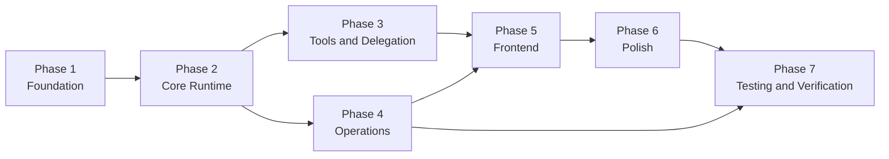

# Execution Phases

This document restructures the `PLAN.md` execution plan into seven delivery phases, with explicit phase dependencies and success criteria.

## Phase 1: Foundation

Scope:

1. Schema and table design (`session`, `tasks`, `todos`, `mcpServers`, `tokenUsage`, `threadRunState`, rate-limit tables)
2. Backend configuration scaffolding and environment validation
3. Lazy setup pattern and ownership-safe query/mutation wrappers
4. Model selection abstraction with deterministic test-mode fallback
5. Session creation and ownership-safe mapping to threads

Success criteria:

- Separate backend package is bootstrapped and deployable
- Schema checks and typecheck pass
- Session CRUD and ownership boundaries work as designed

## Phase 2: Core Runtime

Scope:

1. Orchestrator run loop and queue-per-thread state machine
2. CAS transitions for claim/enqueue/finish
3. Streaming execution path and prompt chaining
4. Message persistence and non-blocking queue behavior
5. Worker lifecycle primitives (`pending`, `running`, `completed`, `failed`, `timed_out`, `cancelled`)

Success criteria:

- One active run per thread with priority queue behavior
- Streaming completes with persisted messages and stable replay behavior
- Core runtime retries and stale-state guards are in place

## Phase 3: Tools and Delegation

Scope:

1. Full tool set wiring (`delegate`, `todoRead`, `todoWrite`, `taskStatus`, `taskOutput`, `webSearch`, `mcpCall`, `mcpDiscover`)
2. Background worker system for delegated tasks
3. MCP integration with discovery, call execution, and cache refresh retry path
4. Structured tool-error payloads and ownership-safe tool execution

Success criteria:

- Delegated tasks execute end-to-end and report completion
- Tool results are visible in conversation flow
- MCP tool calls and discovery function with predictable error handling

## Phase 4: Operations

Scope:

1. Retention crons (active -> idle -> archived -> hard-delete)
2. Stale task/run recovery and timeout transitions
3. Compaction pre-generation flow and lock safety
4. Token usage recording and aggregation
5. Per-user rate limiting for submit/delegate/search/MCP calls

Success criteria:

- Cron transitions run on schedule and enforce retention policy
- Hung run recovery includes 15-minute wall-clock cap
- Compaction and stale recovery preserve runtime safety invariants
- Rate limiting is enforced at entry points

## Phase 5: Frontend

Scope:

1. Session list, chat view, and settings page
2. Streaming UI for text, reasoning, tool calls, and source cards
3. Task/todo/token side panels and responsive layout behavior
4. Auth flow wiring (including test-mode behavior)

Success criteria:

- Core pages are functional on desktop/tablet/mobile
- Streaming and background task visibility are clear in UI
- Ownership and auth behavior match backend boundaries

## Phase 6: Polish

Scope:

1. Loading/error/empty states
2. Accessibility rules (log roles, live regions, keyboard flows)
3. UX quality improvements on list/chat/settings flows
4. Performance and failure-path hardening

Success criteria:

- User-facing states are complete and consistent
- Accessibility requirements are met
- Runtime and UI degrade gracefully under failures

## Phase 7: Testing and Verification

Scope:

1. E2E smoke coverage for core flows
2. Repeatability checks for async and streaming paths
3. Deployment verification (backend deploy + frontend env wiring)
4. Final quality gates (`bun fix`, targeted tests, smoke suite)

Success criteria:

- Smoke suite verifies session CRUD, messaging, tool execution, streaming, and background continuation
- Deployment path is validated in target environment
- Success criteria list from plan is satisfied end-to-end

## Phase dependency graph

## Phase timeline

```mermaid
gantt
  title Delivery timeline (sequential baseline)
  dateFormat  X
  axisFormat  %L
  section Build
  Phase 1 Foundation              :done, p1, 0, 1
  Phase 2 Core Runtime            :done, p2, 1, 1
  Phase 3 Tools and Delegation    :done, p3, 2, 1
  Phase 4 Operations              :done, p4, 3, 1
  Phase 5 Frontend                :done, p5, 4, 1
  Phase 6 Polish                  :done, p6, 5, 1
  Phase 7 Testing and Verification:done, p7, 6, 1
```

## Delivery dependencies

Technical dependencies extracted from plan-level dependency notes:

- AI SDK v6 core APIs for generation and streaming
- Convex functions, schema, and scheduling support
- Convex auth integration for ownership-safe APIs
- `convex-helpers` for rate limit tables and limit checks
- MCP client stack for external tool transport
- Next.js App Router frontend runtime
- Playwright for E2E verification
