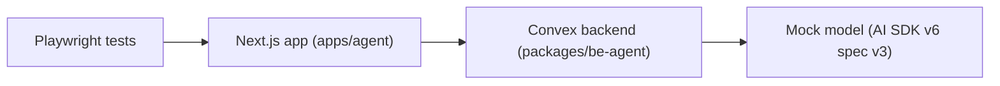
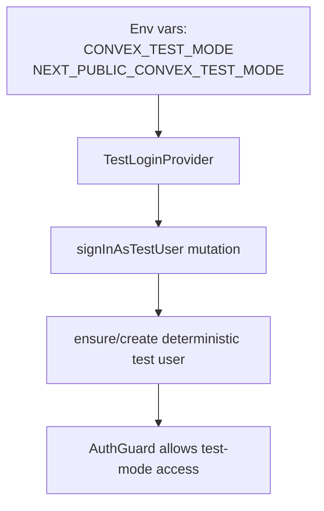

# Testing Plan

This document rewrites the testing strategy from `PLAN.md` and aligns it with monorepo Playwright guidance.

## Testing layers

1. Unit/integration tests for backend runtime behavior (queueing, task lifecycle, continuation, ownership checks, timeout transitions)
2. E2E smoke tests with Playwright for user-visible system behavior
3. Deterministic model behavior in test mode using a mock model compatible with AI SDK v6 provider spec `v3`

References:

- Playwright docs: <https://playwright.dev>
- Monorepo E2E strategy: `/Users/o/z/noboil/AGENTS.md` (isolate -> verify -> expand progression)

## E2E architecture

Playwright drives the Next.js app, which communicates with Convex backend APIs. In test mode, the runtime model resolves to a deterministic mock model.

## Mock model strategy

Test-mode model behavior:

- Uses `specificationVersion: 'v3'`
- Returns deterministic text/tool-call outputs
- Emits v3-compatible streaming events (`text-start`, `text-delta`, `text-end`, `finish`)
- Produces schema-compatible tool args for core tools in smoke scenarios

This keeps E2E behavior deterministic while still exercising orchestration, persistence, and streaming pipelines.

## Test auth bypass flow

Auth bypass is controlled by both backend and frontend test flags:

- Backend: `CONVEX_TEST_MODE=true`
- Frontend: `NEXT_PUBLIC_CONVEX_TEST_MODE=true`

Flow:

1. Frontend `TestLoginProvider` checks `NEXT_PUBLIC_CONVEX_TEST_MODE`
2. In test mode, it calls `signInAsTestUser`
3. Backend test auth helper ensures deterministic test user identity
4. Protected UI routes bypass real OAuth auth guard path in test mode

## Test scripts

Primary `apps/agent/package.json` test scripts:

- `test`: runs Playwright with test-mode env flags
- `test:e2e`: deploys backend once in test mode, then runs Playwright suite

The configured commands set both `CONVEX_TEST_MODE=true` and `NEXT_PUBLIC_CONVEX_TEST_MODE=true` so frontend and backend are in the same auth/model test mode.

## What smoke tests verify

Smoke suite should verify core production-critical flows:

1. Session CRUD: create/list/read and archive behavior
2. Message send/receive: submit message and receive assistant output
3. Tool execution path: delegated/background and direct tool invocation paths
4. Streaming behavior: incremental UI updates and final persisted message state
5. Background lifecycle: pending -> running -> completed and completion reminder handling

## Execution policy from monorepo strategy

Use the AGENTS-guided progression for Playwright:

1. Isolate one failing test
2. Re-run the same test to confirm fix
3. Expand to file-level run
4. Expand to related files
5. Run full suite only when explicitly requested
