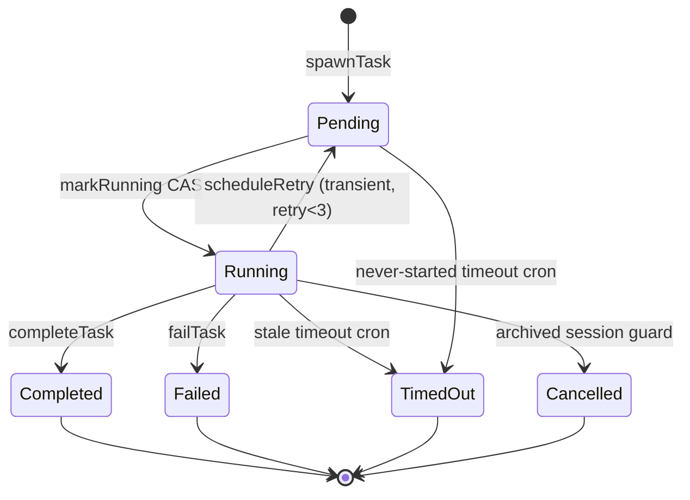
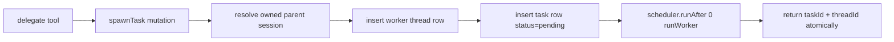
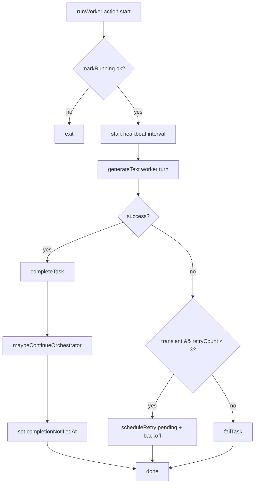
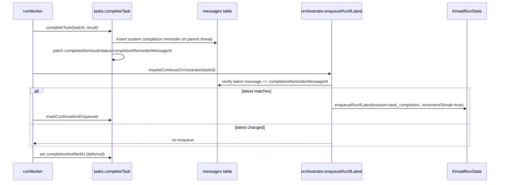

# Worker Runtime (Delegation + Background Tasks)

This document extracts and rewrites worker/task planning from `PLAN.md` for the DIY architecture: AI SDK v6 calls in Convex actions, with task/message persistence in our own Convex tables.

## Scope and References

- PLAN sections: Task Lifecycle, helper functions (task-related), delegation behavior
- OpenAgent references:
  - `oh-my-openagent/src/features/background-agent/`
  - `oh-my-openagent/src/features/claude-tasks/`

## Task State Machine

Canonical task statuses:

- `pending`
- `running`
- terminal: `completed | failed | timed_out | cancelled`
- retry loop: `running -> pending` (bounded retries)

## `spawnTask` Mutation (Atomic spawn + schedule)

`spawnTask` is mutation-first and performs all delegation bootstrapping in one transaction boundary:

1. Resolve parent session ownership from `parentThreadId` + user.
2. Create worker thread record.
3. Insert `tasks` row with `status: 'pending'`, `retryCount: 0`, `pendingAt`.
4. Schedule `runWorker` action immediately.
5. Return `{ taskId, threadId }`.

Because this is one mutation boundary, the parent turn receives a consistent task/thread pair.

## `runWorker` Action Flow

`runWorker` executes worker generation with explicit lifecycle transitions.

1. `markRunning(taskId)` CAS (`pending -> running` only).
2. Start heartbeat interval (`updateHeartbeat` every 30s).
3. Build worker prompt context from `tasks.prompt` and thread messages.
4. Call AI SDK v6 `generateText()` directly (worker usually does single-shot completion).
5. On success: `completeTask(taskId, result)`.
6. On error:
   - if transient and `retryCount < 3`: `scheduleRetry` (`running -> pending`)
   - else `failTask` (`running -> failed`)
7. Clear heartbeat timer in `finally`.

## Completion Reminder Chain

Worker completion does not immediately force a continuation. It first persists a parent-thread reminder, then conditionally enqueues orchestrator continuation.

### Sequence

1. `completeTask` CAS validates `status === 'running'`.
2. Save system completion reminder message to **parent thread** in `messages` table.
3. Patch task:
   - `status: 'completed'`
   - `result`
   - `completedAt`
   - `completionReminderMessageId`
4. Call `maybeContinueOrchestrator(taskId)`.
5. `maybeContinueOrchestrator` runs `enqueueRunIfLatest` with `expectedLatestMessageId`.
6. If enqueue succeeds, mark `continuationEnqueuedAt`.
7. After the notification attempt finishes, set `completionNotifiedAt` (deferred marker).

## Worker Heartbeat and Stale Timeout Cron

### Runtime heartbeat

- `runWorker` sends `updateHeartbeat(taskId)` every 30 seconds while running.
- `markRunning` initializes `startedAt` and first heartbeat.

### Cron-based stale handling

- `timeoutStaleTasks` scans `tasks` by status.
- Running tasks:
  - timeout if `now - (heartbeatAt || startedAt || creationTime) > 10 minutes`
  - patch: `status: 'timed_out'`, `lastError: 'worker_timeout'`
- Pending tasks:
  - timeout if `now - (pendingAt || creationTime) > 5 minutes`
  - patch: `status: 'timed_out'`, `lastError: 'worker_never_started'`

## Retry Policy (Exponential Backoff + Safety Guards)

- Retry only for transient failures (network, timeout, overload, rate-limit class errors).
- Max retries: `3`.
- `scheduleRetry` checks session archival first:
  - if parent session archived: task becomes `cancelled` (`lastError: 'session_archived'`)
  - else patch to `pending`, increment retry, set `pendingAt`, schedule next worker attempt
- Backoff delay: `min(1000 * 2^retryCount, 30000)` ms.

## `completionNotifiedAt` Deferred Ordering

Ordering is intentional:

1. `completeTask` persists completion + reminder message.
2. Notification/continuation attempt (`maybeContinueOrchestrator`) runs.
3. Only then set `completionNotifiedAt`.

This preserves recoverability for crash windows: a task can be `completed` but still have `completionNotifiedAt` unset, allowing future retry/cron notification logic to re-attempt continuation processing.

## v1 Known Limitations

- Crash gap: if worker crashes between `completeTask` and `maybeContinueOrchestrator`, reminder exists but no continuation is enqueued.
- Duplicate side effects on retries: external MCP/tool effects from a failed attempt are not rolled back.
- Prompt duplication on retry can happen in worker thread history (cosmetic).
